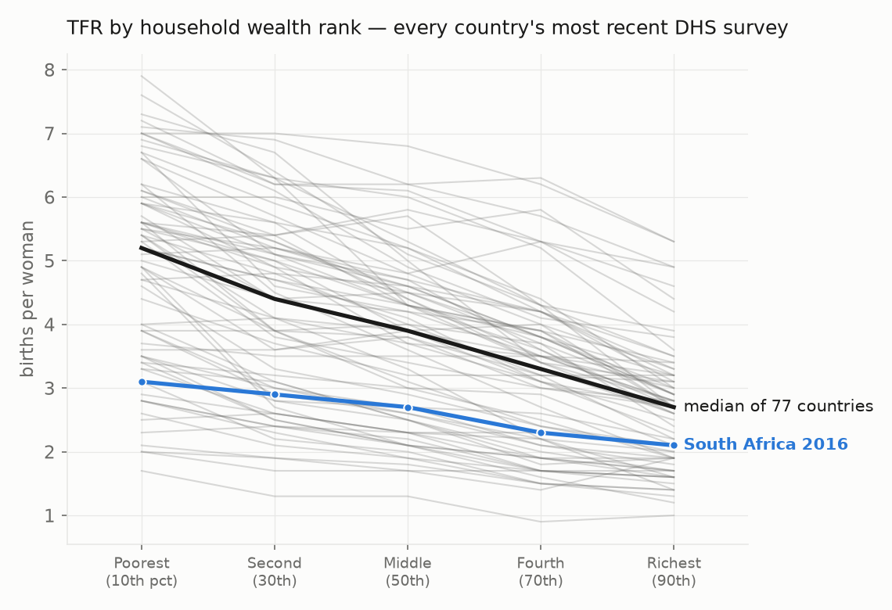
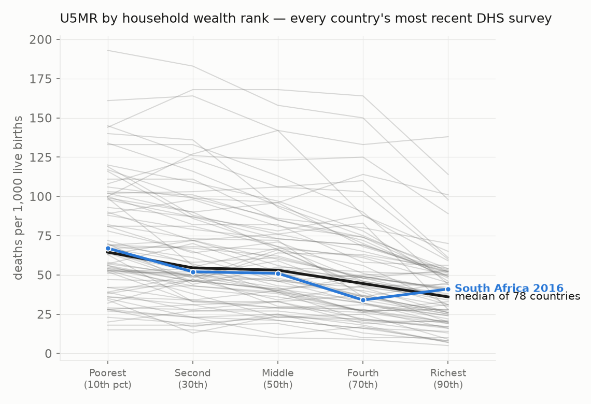
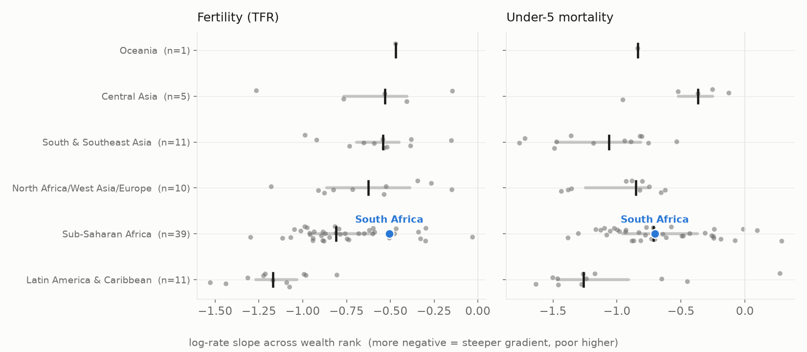
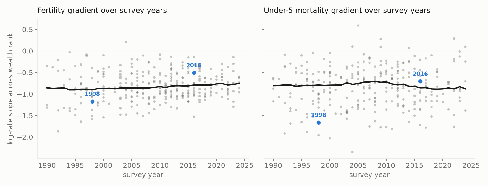

# The gradient library, in figures

Documentation of the data in this repo. **This file is generated** by
[`scripts/build_analysis.py`](scripts/build_analysis.py) from the CSVs in
[`data/`](data/); every number below is computed from the data, not hand-typed,
so it cannot drift. Figures come from
[`scripts/make_figures.py`](scripts/make_figures.py) and live in
[`figures/`](figures/). Regenerate both with `uv run scripts/refresh.py`.

South Africa is highlighted throughout as the worked example; pass
`--highlight "<country>"` to `make_figures.py` to feature any other.

The **tilt** summarizing each survey is the OLS slope of ln(rate) on wealth-rank
percentile midpoints (quintiles at the 10th…90th percentile) — the same log scale
OG-Core's income-group demographics consume. Negative means the poor have higher
rates; a tilt of −0.79 puts the poorest decile's rate at about
e^(0.79×0.8) ≈ 1.9× the richest decile's.

Coverage: **601 surveys with complete wealth quintets across
78 countries** (most recent survey per country used for the library
view below).

## Every country, individually

Nearly every line slopes down: the wealth gradient in fertility is close to
universal. South Africa is both low-fertility and mild-gradient (tilt
−0.51 in 2016, vs the pooled median of −0.79).

The same universal direction holds for child mortality, with wider spread across
countries. South Africa's non-monotonic top quintiles reflect the small
child-mortality samples in its 2016 survey.

## Grouped by region

Each dot is a country's most recent survey; the bar marks the regional
interquartile range and the tick marks the median. Latin America has the steepest
gradients; Sub-Saharan Africa sits mid-range; South Africa is milder than its
region's median on fertility.

**Fertility (TFR) tilt by region**

| Region | Countries | Median tilt | IQR | Median poorest/richest ratio |
|---|---|---|---|---|
| Latin America & Caribbean | 11 | −1.17 | −1.27 to −1.03 | 2.58 |
| Sub-Saharan Africa | 39 | −0.81 | −0.94 to −0.60 | 1.96 |
| North Africa/West Asia/Europe | 10 | −0.62 | −0.86 to −0.39 | 1.60 |
| South & Southeast Asia | 11 | −0.54 | −0.69 to −0.45 | 1.59 |
| Central Asia | 5 | −0.53 | −0.77 to −0.41 | 1.62 |
| Oceania | 1 | −0.47 | (single survey) | 1.56 |

**Under-5 mortality tilt by region**

| Region | Countries | Median tilt | IQR | Median poorest/richest ratio |
|---|---|---|---|---|
| Latin America & Caribbean | 11 | −1.26 | −1.46 to −0.91 | 2.80 |
| South & Southeast Asia | 12 | −1.06 | −1.48 to −0.82 | 2.42 |
| North Africa/West Asia/Europe | 10 | −0.85 | −1.25 to −0.76 | 2.38 |
| Oceania | 1 | −0.84 | (single survey) | 1.92 |
| Sub-Saharan Africa | 39 | −0.72 | −0.96 to −0.37 | 1.80 |
| Central Asia | 5 | −0.37 | −0.52 to −0.25 | 1.40 |

## Stability over survey years

All 601 surveys plotted by fieldwork year, with a rolling median. The
pooled gradient is nearly flat across three and a half decades — wealth gradients
are a stable structural feature, not an eroding one, so a borrowed gradient is not
a decaying quantity. South Africa's own fertility gradient flattened between its
1998 and 2016 surveys.

## Adult mortality gradients (census household-deaths modules)

Adult mortality by wealth comes from census microdata, not DHS surveys (see the
README for why). Households are ranked by an asset index; tilts are on the same
log-rate-per-unit-rank scale as the tables above. The age pattern — steep at
prime working ages, fading in old age — is the by-age shape ogcore's
`mort_gradient` accepts directly.

| Country | Year | Sex | Ages | Measure | Tilt | Poorest/richest | Death records |
|---|---|---|---|---|---|---|---|
| Brazil | 2010 | male | 15–29 | mx | −1.41 | 2.98 | 6,876 |
| Brazil | 2010 | male | 30–44 | mx | −1.54 | 3.42 | 7,328 |
| Brazil | 2010 | male | 45–59 | mx | −0.77 | 1.84 | 11,251 |
| Brazil | 2010 | male | 60–74 | mx | −0.13 | 1.05 | 16,459 |
| Brazil | 2010 | male | 15–59 | 45q15 | −0.99 | 2.19 | 25,455 |
| Brazil | 2010 | female | 15–29 | mx | −0.99 | 2.19 | 1,881 |
| Brazil | 2010 | female | 30–44 | mx | −1.23 | 2.79 | 3,312 |
| Brazil | 2010 | female | 45–59 | mx | −0.97 | 2.26 | 6,896 |
| Brazil | 2010 | female | 60–74 | mx | −0.25 | 1.23 | 12,161 |
| Brazil | 2010 | female | 15–59 | 45q15 | −0.98 | 2.28 | 12,089 |

Ranking: household asset index (see README for the income-vs-assets validation). Rebuild with `uv run scripts/build_adult_mortality_brazil.py`.
