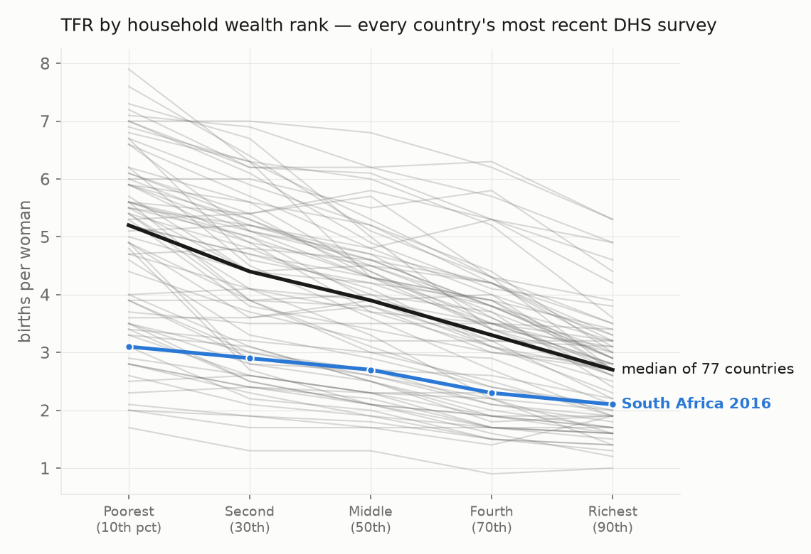
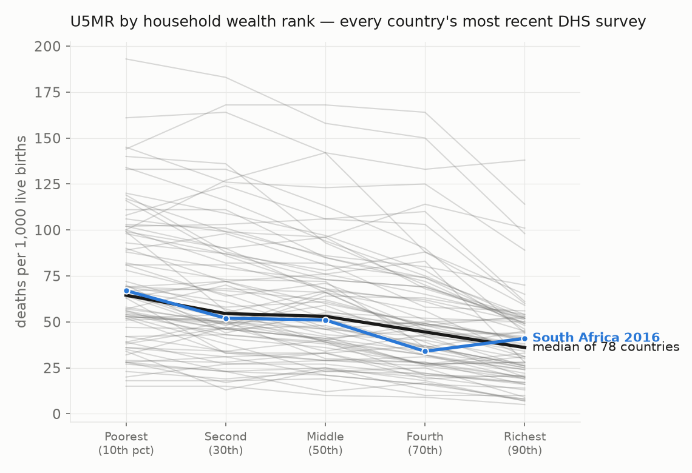
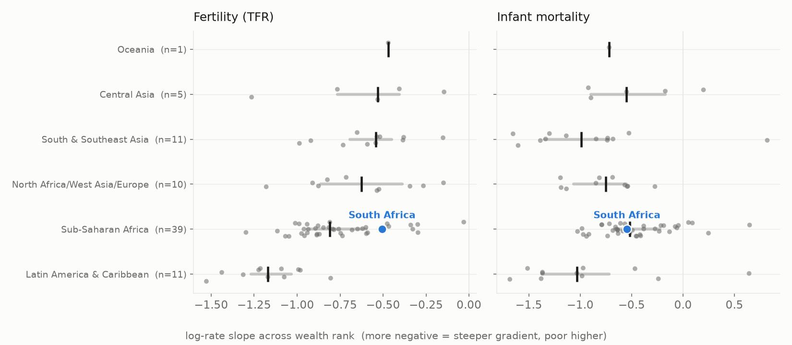
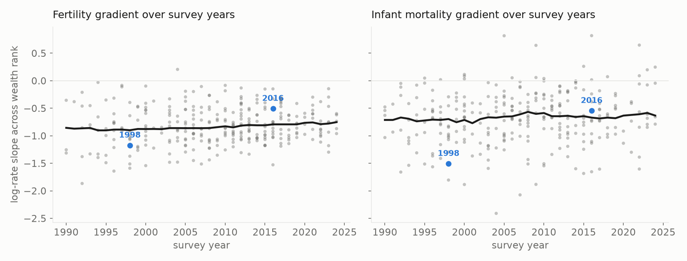
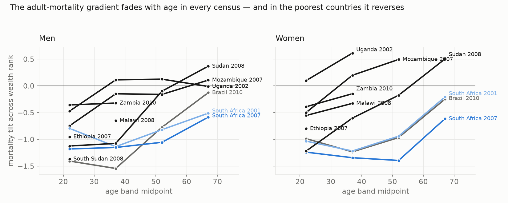

# The gradient library, in figures

Documentation of the data in this repo. **This file is generated** by
[`scripts/build_analysis.py`](scripts/build_analysis.py) from the CSVs in
[`data/`](data/); every number below is computed from the data, not hand-typed,
so it cannot drift. Figures come from
[`scripts/make_figures.py`](scripts/make_figures.py) and live in
[`figures/`](figures/). Regenerate both with `uv run scripts/refresh.py`.

South Africa is highlighted throughout as the worked example; pass
`--highlight "<country>"` to `make_figures.py` to feature any other.

The **tilt** summarizing each survey is the OLS slope of ln(rate) on wealth-rank
percentile midpoints (quintiles at the 10th…90th percentile) — the same log scale
OG-Core's income-group demographics consume. Negative means the poor have higher
rates; a tilt of −0.79 puts the poorest decile's rate at about
e^(0.79×0.8) ≈ 1.9× the richest decile's.

Coverage: **330 surveys with complete wealth quintets across
78 countries**, giving 891 country-survey-margin tilts (most
recent survey per country used for the library view below).

## Every country, individually

Nearly every line slopes down: the wealth gradient in fertility is close to
universal. South Africa is both low-fertility and mild-gradient (tilt
−0.51 in 2016, vs the pooled median of −0.79).

The same universal direction holds for child mortality, with wider spread across
countries. South Africa's non-monotonic top quintiles reflect the small
child-mortality samples in its 2016 survey.

### Use infant mortality, not under-5, for `infmort_gradient`

The library carries both. They are not interchangeable, and the difference runs
one way: across the 289 surveys that report both by wealth quintile, the
under-5 tilt is steeper than the infant tilt by a median
0.14, and it is steeper in 84% of
them. The two are strongly correlated (r = 0.94), so the shape of the
story is the same — but the level is not, and the gap reaches
0.67 (Nigeria 2018).

The reason is what under-5 mortality includes. Deaths between ages 1 and 4 are
dominated by diarrhoea, malaria, and malnutrition, which wealth protects against
strongly; infant deaths lean toward prematurity and birth complications, which it
protects against much less. Using under-5 as the infant proxy therefore imports
the steeper child-mortality gradient into a parameter meant to describe infants.
Prefer `indicator == "IMR"`, and fall back to `"U5MR"` only for the surveys that
report no infant quintiles.

## Grouped by region

Each dot is a country's most recent survey; the bar marks the regional
interquartile range and the tick marks the median. Latin America has the steepest
gradients; Sub-Saharan Africa sits mid-range; South Africa is milder than its
region's median on fertility.

**Fertility (TFR) tilt by region**

| Region | Countries | Median tilt | IQR | Median poorest/richest ratio |
|---|---|---|---|---|
| Latin America & Caribbean | 11 | −1.17 | −1.27 to −1.03 | 2.58 |
| Sub-Saharan Africa | 39 | −0.81 | −0.94 to −0.60 | 1.96 |
| North Africa/West Asia/Europe | 10 | −0.62 | −0.86 to −0.39 | 1.60 |
| South & Southeast Asia | 11 | −0.54 | −0.69 to −0.45 | 1.59 |
| Central Asia | 5 | −0.53 | −0.77 to −0.41 | 1.62 |
| Oceania | 1 | −0.47 | (single survey) | 1.56 |

**Infant mortality tilt by region** — the series `infmort_gradient` should use

| Region | Countries | Median tilt | IQR | Median poorest/richest ratio |
|---|---|---|---|---|
| Latin America & Caribbean | 11 | −1.03 | −1.37 to −0.72 | 2.69 |
| South & Southeast Asia | 12 | −0.99 | −1.35 to −0.72 | 2.26 |
| North Africa/West Asia/Europe | 10 | −0.75 | −1.06 to −0.55 | 2.06 |
| Oceania | 1 | −0.72 | (single survey) | 1.74 |
| Central Asia | 5 | −0.55 | −0.90 to −0.17 | 1.53 |
| Sub-Saharan Africa | 39 | −0.52 | −0.67 to −0.22 | 1.52 |

**Under-5 mortality tilt by region** — the fallback, and steeper (see below)

| Region | Countries | Median tilt | IQR | Median poorest/richest ratio |
|---|---|---|---|---|
| Latin America & Caribbean | 11 | −1.26 | −1.46 to −0.91 | 2.80 |
| South & Southeast Asia | 12 | −1.06 | −1.48 to −0.82 | 2.42 |
| North Africa/West Asia/Europe | 10 | −0.85 | −1.25 to −0.76 | 2.38 |
| Oceania | 1 | −0.84 | (single survey) | 1.92 |
| Sub-Saharan Africa | 39 | −0.72 | −0.96 to −0.37 | 1.80 |
| Central Asia | 5 | −0.37 | −0.52 to −0.25 | 1.40 |

## Stability over survey years

All 891 country-survey-margin tilts plotted by fieldwork year, with a
rolling median. The
pooled gradient is nearly flat across three and a half decades — wealth gradients
are a stable structural feature, not an eroding one, so a borrowed gradient is not
a decaying quantity. South Africa's own fertility gradient flattened between its
1998 and 2016 surveys.

**Stable across countries is not the same as stable within one.** The flat line
above is a pooled median over many countries; a single fast-developing country
can move a long way underneath it. Brazil is the worked case — see the census
series below, where its child-mortality gradient roughly halves in twenty years.
Read the pooled stability as "a borrowed gradient does not decay", not as "a
country's own gradient will not change".

## Child mortality from censuses, and Brazil's twenty-year trend

The DHS child-mortality gradients above are one survey per country, and for some
countries that survey is old — Brazil's only usable DHS is 1996. Censuses ask
every mother how many children she has borne and how many are still alive, so
the household asset index already used for adult mortality yields a
child-mortality gradient for any census year, including years no survey covers.
These rows live in
[`data/census_child_mortality.csv`](data/census_child_mortality.csv).

The measure is the proportion of children ever born who have died — the classic
Brass indirect indicator, for mothers aged 25–29. It is cumulative rather than a
period rate, so **its levels are not comparable to DHS U5MR levels and must not
be pooled with them.** Only the tilt is comparable.

That comparability was tested rather than assumed. Brazil's 2000 census sits four
years after its 1996 DHS, and the two agree to 0.014: the census
gives −1.45 where the Brazil 1996 DHS U5MR gradient is
−1.46. Two independent sources, with different measures and
different wealth rankings, landing on the same number.

| Census | Groups | Tilt | Poorest/richest | Poorest group's children dead |
|---|---|---|---|---|
| 1991 | 4 | −1.76 | 4.41 | 10.6% |
| 2000 | 4 | −1.45 | 3.20 | 6.2% |
| 2010 | 5 | −0.84 | 2.08 | 2.4% |

**Brazil's child-mortality gradient roughly halved**, from −1.76 in
1991 to −0.84 in 2010. Child mortality fell in every
group, but proportionally faster among the poor, and the poorest-to-richest ratio
narrowed from 4.4× to 2.1×.

That is a real change, not an artefact of the asset index growing richer over
time (1991 offers four asset variables, 2010 offers ten). Re-estimating every
census on only the assets common to all three — electricity, fridge, TV, radio
and cars — the flattening is *larger*, 1.06 against
0.91 on the full index. Both variants are published, tagged by
the `index` column; use `index == "full"`, which supports more wealth groups. The
common-index 2010 estimate collapses to two groups, because by then nearly every
Brazilian household owned all four items — a warning that simple durable-goods
indices stop discriminating as a country gets richer.

**For calibration:** the library's Brazil DHS row is a 1996 tilt of −1.46, and by
2010 the value was near −0.84. A present-day Brazilian calibration
using the DHS row overstates the child-mortality gradient by roughly 0.5.

## Adult mortality gradients (census household-deaths modules)

Adult mortality by wealth comes from census microdata, not DHS surveys (see the
README for why). Households are ranked by an asset index; tilts are on the same
log-rate-per-unit-rank scale as the tables above. The age pattern — steepest at
prime working ages, fading in old age — is the by-age shape ogcore's
`mort_gradient` accepts directly, and it holds in every one of the
18 censuses measured:

### The general gradient: what to use when a country has no measurement of its own

Most countries have no measured adult-mortality gradient. The library therefore
publishes a fallback in
[`data/general_gradient.csv`](data/general_gradient.csv), and the rule for using
it is simple: **a country with its own measurement should always prefer it; the
general gradient is for everyone else.**

The steepness of the gradient tracks how rich the country is:

    tilt(45q15) = 1.291 − 0.244 × ln(GNI per capita, current US$)

with r = −0.88 across 17 censuses and a 1 SD band of
±0.16. Doubling income per head steepens the gradient by about
−0.17.

That rule was chosen by competition, not assertion. Three candidates were each
judged by leaving one census out of the fit and predicting it — the honest test,
because a country using the fallback is by definition not in the fit:

| Candidate rule | Mean absolute error |
|---|---|
| One tilt for every country (the pooled median, −0.36) | 0.301 |
| **Read it off national income** | **0.138** |
| The country's regional median | 0.182 |

Income is wrong by less than half as much as a single global number, and a third
less than regional medians. So there is a general gradient, and income — not
region — is what it tracks. It is also most accurate in the middle-income range
where the countries needing it actually sit, and it reproduces South Africa's own
census measurement to within a rounding error.

To spread the summary tilt across age bands, which is what ogcore's
`mort_gradient` accepts, add these pooled offsets:

| Age band | Offset to add | |
|---|---|---|
| 15-29 | −0.41 |  |
| 30-44 | −0.20 |  |
| 45-59 | 0.13 | least trustworthy |
| 60-74 | 0.40 | least trustworthy |

Applying an offset this way reproduces a country's own measured band tilt to a
median ±0.17, so the age shape is a good deal coarser than the level.

**The 45–59 and 60–74 offsets are the least trustworthy numbers in this file.**
They are positive because in the poorest countries measured mortality rises with
wealth at older ages, and that may not be real — see the next section. A model
that only needs working-age mortality should prefer the 15–29 and 30–44 offsets
and treat the older ones as an upper bound on flatness.

**Do not hold a low-income country's tilt fixed across a long transition.** As
income rises the gradient should be expected to steepen toward the upper-middle
values in this table — Malawi is the worked case, its own measured tilt moving
from −0.02 to −0.28 as income per head roughly doubled between
its 1998 and 2008 censuses, within 0.07 of what the rule predicts.

The rule is fitted between about $200 and $10,000 of GNI per head, which is the
range this library covers by design: every source it draws on is a
developing-country instrument. Do not extrapolate it to high-income countries.

### The reversal at older ages, and why HIV does not explain it

In the poorest countries the gradient is flat, and at older ages it turns
positive: measured mortality is *higher* in wealthier households in Ethiopia
2007, Uganda 2002, South Sudan 2008 and Mozambique 2007. Where almost everyone
is poor, the top asset group is barely better protected, and deaths are
infectious and maternal rather than the socially graded chronic diseases of
middle income. Against that, a frail elderly relative often moves into a
better-off household before dying, which records the death against that
household's wealth.

Independent evidence now favours a reporting explanation for at least part of
it. In DHS sibling histories — a different source, also relying on a
household's recall of deaths — poorer and less educated respondents report
*fewer* siblings than richer ones despite having far more children of their own,
and the deficit grows the further back they are asked to recall. Under-reporting
of deaths by poorer respondents flattens or reverses a measured gradient in
exactly this way. That does not prove the census reversal is artefactual, but it
makes it the more likely reading, and it is why the older-age offsets above
carry a warning.

HIV does not explain the pattern: excluding South Africa, the correlation
between the tilt and HIV prevalence is +0.00, Lesotho has the set's highest
prevalence with a solidly negative tilt, and the reversal is strongest at
60–74, where HIV mortality is rare.

### What the columns mean, and what was left out

`linked` is the share of the census's death records that reached estimation.
Where it is well below 1 (South Africa 2011), rate *levels* are meaningless but
the tilt is unbiased — the linked deaths' composition matches the unlinked on
province, urban/rural, sex, and age.

Every sample here passed a completeness check: the supplementary per-death file
is compared, *within each wealth group*, against the same households' own
reported death counts (`MORTNUM`). Even record loss cancels out of a tilt;
wealth-skewed loss does not. Three samples failed and are deliberately absent —
the IPUMS mortality supplement for Brazil 2010 (holds 48% of the deaths the
census itself reports, with the loss concentrated in wealthy households; the
Brazil rows below come from IBGE's own microdata instead), Nepal 2001, and El
Salvador 2007. Their evidence is recorded in
`scripts/build_adult_mortality.py`.

| Country | Year | Sex | Ages | Measure | Tilt | Poorest/richest | Death records | Linked |
|---|---|---|---|---|---|---|---|---|
| Brazil | 2010 | male | 15–29 | mx | −1.41 | 2.98 | 6,876 | 100% |
| Brazil | 2010 | male | 30–44 | mx | −1.54 | 3.42 | 7,328 | 100% |
| Brazil | 2010 | male | 45–59 | mx | −0.77 | 1.84 | 11,251 | 100% |
| Brazil | 2010 | male | 60–74 | mx | −0.13 | 1.05 | 16,459 | 100% |
| Brazil | 2010 | male | 15–59 | 45q15 | −0.99 | 2.19 | 25,455 | 100% |
| Brazil | 2010 | female | 15–29 | mx | −0.99 | 2.19 | 1,881 | 100% |
| Brazil | 2010 | female | 30–44 | mx | −1.23 | 2.79 | 3,312 | 100% |
| Brazil | 2010 | female | 45–59 | mx | −0.97 | 2.26 | 6,896 | 100% |
| Brazil | 2010 | female | 60–74 | mx | −0.25 | 1.23 | 12,161 | 100% |
| Brazil | 2010 | female | 15–59 | 45q15 | −0.98 | 2.28 | 12,089 | 100% |
| South Africa | 2001 | all | 15–29 | mx | −0.92 | 1.98 | 5,939 | 100% |
| South Africa | 2001 | all | 30–44 | mx | −1.17 | 2.55 | 8,504 | 100% |
| South Africa | 2001 | all | 45–59 | mx | −0.86 | 1.95 | 5,750 | 100% |
| South Africa | 2001 | all | 60–74 | mx | −0.32 | 1.28 | 5,489 | 100% |
| South Africa | 2001 | all | 15–59 | 45q15 | −0.79 | 1.86 | 20,193 | 100% |
| South Africa | 2001 | male | 15–29 | mx | −0.80 | 1.84 | 2,835 | 100% |
| South Africa | 2001 | male | 30–44 | mx | −1.14 | 2.57 | 4,564 | 100% |
| South Africa | 2001 | male | 45–59 | mx | −0.82 | 1.95 | 3,558 | 100% |
| South Africa | 2001 | male | 60–74 | mx | −0.51 | 1.48 | 2,983 | 100% |
| South Africa | 2001 | male | 15–59 | 45q15 | −0.70 | 1.78 | 10,957 | 100% |
| South Africa | 2001 | female | 15–29 | mx | −1.03 | 2.12 | 3,104 | 100% |
| South Africa | 2001 | female | 30–44 | mx | −1.22 | 2.57 | 3,940 | 100% |
| South Africa | 2001 | female | 45–59 | mx | −0.94 | 2.02 | 2,192 | 100% |
| South Africa | 2001 | female | 60–74 | mx | −0.21 | 1.19 | 2,506 | 100% |
| South Africa | 2001 | female | 15–59 | 45q15 | −0.89 | 1.98 | 9,236 | 100% |
| South Africa | 2007 | all | 15–29 | mx | −1.21 | 2.35 | 2,421 | 100% |
| South Africa | 2007 | all | 30–44 | mx | −1.25 | 2.41 | 4,353 | 100% |
| South Africa | 2007 | all | 45–59 | mx | −1.21 | 2.25 | 2,693 | 100% |
| South Africa | 2007 | all | 60–74 | mx | −0.56 | 1.41 | 1,963 | 100% |
| South Africa | 2007 | all | 15–59 | 45q15 | −0.80 | 1.73 | 9,467 | 100% |
| South Africa | 2007 | male | 15–29 | mx | −1.18 | 2.31 | 1,071 | 100% |
| South Africa | 2007 | male | 30–44 | mx | −1.15 | 2.27 | 2,207 | 100% |
| South Africa | 2007 | male | 45–59 | mx | −1.06 | 2.05 | 1,603 | 100% |
| South Africa | 2007 | male | 60–74 | mx | −0.59 | 1.47 | 1,061 | 100% |
| South Africa | 2007 | male | 15–59 | 45q15 | −0.68 | 1.60 | 4,881 | 100% |
| South Africa | 2007 | female | 15–29 | mx | −1.24 | 2.40 | 1,350 | 100% |
| South Africa | 2007 | female | 30–44 | mx | −1.34 | 2.53 | 2,146 | 100% |
| South Africa | 2007 | female | 45–59 | mx | −1.40 | 2.51 | 1,090 | 100% |
| South Africa | 2007 | female | 60–74 | mx | −0.62 | 1.41 | 902 | 100% |
| South Africa | 2007 | female | 15–59 | 45q15 | −0.92 | 1.87 | 4,586 | 100% |
| South Africa | 2011 | all | 30–44 | mx | −0.99 | 1.98 | 905 | 9% |
| South Africa | 2011 | all | 15–59 | 45q15 | −0.80 | 1.75 | 2,098 | 9% |
| South Africa | 2011 | male | 15–59 | 45q15 | −0.74 | 1.74 | 1,123 | 9% |
| South Africa | 2011 | female | 15–59 | 45q15 | −0.87 | 1.76 | 972 | 9% |
| Ethiopia | 2007 | all | 15–29 | mx | −0.87 | 1.79 | 1,957 | 100% |
| Ethiopia | 2007 | all | 30–44 | mx | 0.08 | 0.93 | 1,472 | 100% |
| Ethiopia | 2007 | all | 45–59 | mx | 0.58 | 0.66 | 900 | 100% |
| Ethiopia | 2007 | all | 60–74 | mx | 0.44 | 0.75 | 957 | 100% |
| Ethiopia | 2007 | all | 15–59 | 45q15 | 0.09 | 0.93 | 4,329 | 100% |
| Ethiopia | 2007 | male | 15–29 | mx | −0.95 | 1.89 | 974 | 100% |
| Ethiopia | 2007 | male | 15–59 | 45q15 | −0.13 | 1.07 | 2,247 | 100% |
| Ethiopia | 2007 | female | 15–29 | mx | −0.80 | 1.70 | 983 | 100% |
| Ethiopia | 2007 | female | 15–59 | 45q15 | 0.34 | 0.79 | 2,082 | 100% |
| Zambia | 2010 | all | 15–29 | mx | −0.37 | 1.32 | 2,354 | 100% |
| Zambia | 2010 | all | 30–44 | mx | −0.24 | 1.15 | 2,899 | 100% |
| Zambia | 2010 | all | 45–59 | mx | −0.22 | 1.10 | 1,433 | 100% |
| Zambia | 2010 | all | 60–74 | mx | 0.48 | 0.69 | 1,147 | 100% |
| Zambia | 2010 | all | 15–59 | 45q15 | −0.18 | 1.11 | 6,686 | 100% |
| Zambia | 2010 | male | 15–29 | mx | −0.36 | 1.30 | 1,147 | 100% |
| Zambia | 2010 | male | 30–44 | mx | −0.32 | 1.19 | 1,652 | 100% |
| Zambia | 2010 | male | 15–59 | 45q15 | −0.31 | 1.18 | 3,630 | 100% |
| Zambia | 2010 | female | 15–29 | mx | −0.39 | 1.33 | 1,207 | 100% |
| Zambia | 2010 | female | 30–44 | mx | −0.15 | 1.10 | 1,247 | 100% |
| Zambia | 2010 | female | 15–59 | 45q15 | −0.06 | 1.05 | 3,056 | 100% |
| Malawi | 2008 | all | 15–29 | mx | −0.71 | 1.65 | 1,941 | 99% |
| Malawi | 2008 | all | 30–44 | mx | −0.50 | 1.30 | 2,243 | 99% |
| Malawi | 2008 | all | 45–59 | mx | −0.10 | 0.95 | 1,059 | 99% |
| Malawi | 2008 | all | 15–59 | 45q15 | −0.28 | 1.13 | 5,243 | 99% |
| Malawi | 2008 | male | 30–44 | mx | −0.65 | 1.36 | 1,198 | 99% |
| Malawi | 2008 | male | 15–59 | 45q15 | −0.45 | 1.25 | 2,724 | 99% |
| Malawi | 2008 | female | 15–29 | mx | −0.55 | 1.46 | 1,054 | 99% |
| Malawi | 2008 | female | 30–44 | mx | −0.33 | 1.23 | 1,045 | 99% |
| Malawi | 2008 | female | 15–59 | 45q15 | −0.11 | 1.04 | 2,519 | 99% |
| Mozambique | 2007 | all | 15–29 | mx | −0.62 | 1.66 | 4,110 | 100% |
| Mozambique | 2007 | all | 30–44 | mx | 0.03 | 0.97 | 4,637 | 100% |
| Mozambique | 2007 | all | 45–59 | mx | 0.19 | 0.84 | 2,863 | 100% |
| Mozambique | 2007 | all | 60–74 | mx | 0.66 | 0.60 | 2,176 | 100% |
| Mozambique | 2007 | all | 15–59 | 45q15 | −0.01 | 1.00 | 11,610 | 100% |
| Mozambique | 2007 | male | 15–29 | mx | −0.75 | 1.84 | 1,794 | 100% |
| Mozambique | 2007 | male | 30–44 | mx | −0.15 | 1.14 | 2,458 | 100% |
| Mozambique | 2007 | male | 45–59 | mx | −0.16 | 1.07 | 1,657 | 100% |
| Mozambique | 2007 | male | 60–74 | mx | 0.11 | 0.89 | 1,281 | 100% |
| Mozambique | 2007 | male | 15–59 | 45q15 | −0.16 | 1.11 | 5,909 | 100% |
| Mozambique | 2007 | female | 15–29 | mx | −0.50 | 1.51 | 2,297 | 100% |
| Mozambique | 2007 | female | 30–44 | mx | 0.20 | 0.83 | 2,171 | 100% |
| Mozambique | 2007 | female | 45–59 | mx | 0.49 | 0.68 | 1,193 | 100% |
| Mozambique | 2007 | female | 15–59 | 45q15 | 0.12 | 0.91 | 5,661 | 100% |
| Uganda | 2002 | all | 15–29 | mx | −0.18 | 1.15 | 3,905 | 100% |
| Uganda | 2002 | all | 30–44 | mx | 0.34 | 0.72 | 4,511 | 100% |
| Uganda | 2002 | all | 45–59 | mx | 0.29 | 0.74 | 2,054 | 100% |
| Uganda | 2002 | all | 60–74 | mx | 0.44 | 0.72 | 1,905 | 100% |
| Uganda | 2002 | all | 15–59 | 45q15 | 0.17 | 0.83 | 10,470 | 100% |
| Uganda | 2002 | male | 15–29 | mx | −0.47 | 1.47 | 1,827 | 100% |
| Uganda | 2002 | male | 30–44 | mx | 0.11 | 0.86 | 2,461 | 100% |
| Uganda | 2002 | male | 45–59 | mx | 0.13 | 0.84 | 1,227 | 100% |
| Uganda | 2002 | male | 60–74 | mx | −0.01 | 0.97 | 1,105 | 100% |
| Uganda | 2002 | male | 15–59 | 45q15 | 0.01 | 0.95 | 5,515 | 100% |
| Uganda | 2002 | female | 15–29 | mx | 0.10 | 0.91 | 2,078 | 100% |
| Uganda | 2002 | female | 30–44 | mx | 0.61 | 0.57 | 2,050 | 100% |
| Uganda | 2002 | female | 15–59 | 45q15 | 0.37 | 0.71 | 4,955 | 100% |
| Rwanda | 2002 | all | 15–59 | 45q15 | −0.38 | 1.31 | 1,846 | 100% |
| Rwanda | 2002 | male | 15–59 | 45q15 | −0.58 | 1.50 | 950 | 100% |
| Rwanda | 2002 | female | 15–59 | 45q15 | −0.19 | 1.15 | 886 | 100% |
| Senegal | 2002 | all | 15–29 | mx | −0.73 | 1.84 | 1,086 | 100% |
| Senegal | 2002 | all | 30–44 | mx | −0.55 | 1.70 | 1,086 | 100% |
| Senegal | 2002 | all | 60–74 | mx | −0.15 | 1.07 | 1,311 | 100% |
| Senegal | 2002 | all | 15–59 | 45q15 | −0.34 | 1.33 | 3,039 | 100% |
| Senegal | 2002 | male | 15–59 | 45q15 | −0.38 | 1.40 | 1,311 | 100% |
| Senegal | 2002 | female | 15–59 | 45q15 | −0.28 | 1.25 | 1,725 | 100% |
| Sierra Leone | 2004 | all | 15–29 | mx | −0.66 | 1.75 | 1,182 | 100% |
| Sierra Leone | 2004 | all | 30–44 | mx | −0.25 | 1.28 | 1,057 | 100% |
| Sierra Leone | 2004 | all | 60–74 | mx | −0.30 | 1.25 | 918 | 100% |
| Sierra Leone | 2004 | all | 15–59 | 45q15 | −0.26 | 1.28 | 3,056 | 100% |
| Sierra Leone | 2004 | male | 15–59 | 45q15 | −0.35 | 1.39 | 1,487 | 100% |
| Sierra Leone | 2004 | female | 15–59 | 45q15 | −0.16 | 1.16 | 1,569 | 100% |
| Lesotho | 2006 | all | 30–44 | mx | −0.96 | 2.51 | 1,186 | 100% |
| Lesotho | 2006 | all | 15–59 | 45q15 | −0.43 | 1.47 | 2,572 | 100% |
| Lesotho | 2006 | male | 15–59 | 45q15 | −0.35 | 1.37 | 1,270 | 100% |
| Lesotho | 2006 | female | 15–59 | 45q15 | −0.51 | 1.58 | 1,302 | 100% |
| Benin | 2013 | all | 15–59 | 45q15 | −0.66 | 1.81 | 1,555 | 100% |
| Benin | 2013 | male | 15–59 | 45q15 | −0.90 | 2.32 | 875 | 100% |
| Benin | 2013 | female | 15–59 | 45q15 | −0.36 | 1.31 | 680 | 100% |
| Cote d'Ivoire | 1998 | all | 15–29 | mx | −0.94 | 2.14 | 2,128 | 100% |
| Cote d'Ivoire | 1998 | all | 30–44 | mx | −0.76 | 1.84 | 2,240 | 100% |
| Cote d'Ivoire | 1998 | all | 45–59 | mx | −0.36 | 1.37 | 1,561 | 100% |
| Cote d'Ivoire | 1998 | all | 60–74 | mx | −0.04 | 0.94 | 1,621 | 100% |
| Cote d'Ivoire | 1998 | all | 15–59 | 45q15 | −0.48 | 1.49 | 5,929 | 100% |
| Cote d'Ivoire | 1998 | male | 15–29 | mx | −0.85 | 1.97 | 909 | 100% |
| Cote d'Ivoire | 1998 | male | 30–44 | mx | −0.87 | 2.08 | 1,185 | 100% |
| Cote d'Ivoire | 1998 | male | 15–59 | 45q15 | −0.56 | 1.62 | 2,990 | 100% |
| Cote d'Ivoire | 1998 | female | 15–29 | mx | −1.00 | 2.26 | 1,219 | 100% |
| Cote d'Ivoire | 1998 | female | 30–44 | mx | −0.66 | 1.65 | 1,055 | 100% |
| Cote d'Ivoire | 1998 | female | 15–59 | 45q15 | −0.41 | 1.37 | 2,939 | 100% |
| Malawi | 1998 | all | 15–29 | mx | −0.32 | 1.57 | 2,764 | 100% |
| Malawi | 1998 | all | 30–44 | mx | −0.06 | 1.39 | 2,204 | 100% |
| Malawi | 1998 | all | 45–59 | mx | 0.12 | 1.04 | 1,412 | 100% |
| Malawi | 1998 | all | 15–59 | 45q15 | −0.02 | 1.18 | 6,380 | 100% |
| Malawi | 1998 | male | 15–29 | mx | −0.52 | 1.78 | 1,507 | 100% |
| Malawi | 1998 | male | 30–44 | mx | −0.23 | 1.65 | 1,182 | 100% |
| Malawi | 1998 | male | 15–59 | 45q15 | −0.12 | 1.33 | 3,514 | 100% |
| Malawi | 1998 | female | 15–29 | mx | −0.13 | 1.40 | 1,257 | 100% |
| Malawi | 1998 | female | 30–44 | mx | 0.10 | 1.19 | 1,022 | 100% |
| Malawi | 1998 | female | 15–59 | 45q15 | 0.07 | 1.04 | 2,866 | 100% |
| Sudan | 2008 | all | 15–29 | mx | −1.17 | 2.24 | 7,995 | 100% |
| Sudan | 2008 | all | 30–44 | mx | −0.85 | 1.77 | 5,739 | 100% |
| Sudan | 2008 | all | 45–59 | mx | −0.13 | 1.08 | 3,980 | 100% |
| Sudan | 2008 | all | 60–74 | mx | 0.43 | 0.76 | 4,544 | 100% |
| Sudan | 2008 | all | 15–59 | 45q15 | −0.47 | 1.37 | 17,714 | 100% |
| Sudan | 2008 | male | 15–29 | mx | −1.12 | 2.13 | 4,262 | 100% |
| Sudan | 2008 | male | 30–44 | mx | −1.08 | 2.10 | 3,259 | 100% |
| Sudan | 2008 | male | 45–59 | mx | −0.10 | 1.03 | 2,205 | 100% |
| Sudan | 2008 | male | 60–74 | mx | 0.37 | 0.79 | 2,709 | 100% |
| Sudan | 2008 | male | 15–59 | 45q15 | −0.51 | 1.39 | 9,726 | 100% |
| Sudan | 2008 | female | 15–29 | mx | −1.22 | 2.37 | 3,733 | 100% |
| Sudan | 2008 | female | 30–44 | mx | −0.60 | 1.47 | 2,480 | 100% |
| Sudan | 2008 | female | 45–59 | mx | −0.18 | 1.14 | 1,775 | 100% |
| Sudan | 2008 | female | 60–74 | mx | 0.50 | 0.73 | 1,835 | 100% |
| Sudan | 2008 | female | 15–59 | 45q15 | −0.44 | 1.36 | 7,988 | 100% |
| South Sudan | 2008 | all | 15–29 | mx | −0.98 | 1.79 | 1,857 | 100% |
| South Sudan | 2008 | all | 15–59 | 45q15 | 0.09 | 0.95 | 2,859 | 100% |
| South Sudan | 2008 | male | 15–29 | mx | −1.37 | 2.24 | 1,092 | 100% |
| South Sudan | 2008 | male | 15–59 | 45q15 | −0.30 | 1.19 | 1,724 | 100% |
| South Sudan | 2008 | female | 15–59 | 45q15 | 0.62 | 0.69 | 1,135 | 100% |

Ranking: household asset index (see README for the income-vs-assets validation and the build pipeline; asset components vary by census and are recorded in `scripts/build_adult_mortality.py`).
